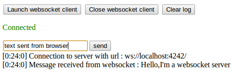

# Websocket non-blocking server library

[](https://travis-ci.org/akinaru/websocket-non-blocking)
[](LICENSE.md)

http://akinaru.github.io/websocket-non-blocking/

C++ websocket non-blocking server library for Qt4/Qt5

## Usage

Start websocket server :
```
WebsocketServer server;

bool success = server.listen(QHostAddress("127.0.0.1"), 8443);
```

Stop websocket server :
```
server.close();
```

## Integrate in your project

* from git submodule

```
git submodule add git://github.com/akinaru/websocket-non-blocking.git
```

and in your `project.pro` :

```
TEMPLATE = subdirs
SUBDIRS = websocket-non-blocking your-app
your-app.depends = websocket-non-blocking
```

with in `your-app.pro` :

```
TARGET = your-app
SOURCES = main.cpp
INCLUDEPATH += $$PWD/../websocket-non-blocking/libwebsocket/release
LIBS += -L$$PWD/../websocket-non-blocking/libwebsocket/release -lwebsocket
DEPENDPATH += $$PWD/../websocket-non-blocking/libwebsocket/release
```

## Monitor clients

Build your own client monitoring class that inherits `IClientEventListener` : 

```
class ClientSocketHandler :  public IClientEventListener
{
public:

    ClientSocketHandler();

    ~ClientSocketHandler();

    void onClientClose(IWebsocketClient &client);

    void onClientConnection(IWebsocketClient &client);

    void onMessageReceivedFromClient(IWebsocketClient &client, std::string message);
};
```

Add listener to server instance : 

```
#include "ClientSockethandler.h"

....

ClientSocketHandler *clientHandler = new ClientSocketHandler();

server.addClientEventListener(clientHandler);
```

In this `ClientSocketHandler` you have 3 callbacks that will notify you on client connection change and arrival of client messages :

* `void onClientClose(IWebsocketClient &client);` notify when client socket close
* `void onClientConnection(IWebsocketClient &client);` notify when client socket connect to server
* `void onMessageReceivedFromClient(IWebsocketClient &client,std::string message);` notify when a socket client send a message to you

You can send a message back with `IWebsocketClient` sent from the same callback with `sendMessage(std::string textToSend)` method :

```
void ClientSocketHandler::onMessageReceivedFromClient(IWebsocketClient &client,string message)
{
    cout << "Client socket message received : " << message.data() << endl;

    client.sendMessage("OK I received your message !");
}
```

Check the client monitoring example [here](./libwebsocket-test/ClientSocketHandler.cpp)

## SSL secured websocket server

```
WebsocketServer server;

server.setSSL(true); // set SSL to true (default is false)
```

Then you set your public/private/ca certificates separately with respective methods : 

```
server.setPublicCert(SslHandler::retrieveCertFromFile(PUBLIC_CERT));
server.setPrivateCert(SslHandler::retrieveKeyCertFile(PRIVATE_CERT,PRIVATE_CERT_PASS));
server.setCaCert(SslHandler::retrieveveCaCertListFromFile(CA_CERTS));
```

You can use static method from [`SslHandler`](./libwebsocket-test/SslHandler.cpp) :

* public cert must be a QSslCertificate : `SslHandler::retrieveCertFromFile(char * filepath)`
* private cert must be a QSslKey : `SslHandler::retrieveKeyCertFile(char * filepath,char * passKey)`
* CA cert must be a QList of QSslCertificate : `SslHandler::retrieveveCaCertListFromFile(char * filepath)`

Eventually add event listener as described above and start websocket server : 

```
server.addClientEventListener(clientHandler);

bool success = server.listen(QHostAddress("127.0.0.1"), 8443);
```

## Troubleshooting SSL errors with local browser JS client

>Bad certificate | Unknown CA errors

This could mean you didn't import your not-trusted-CA certificate into your browser.

>The remote host closed the connection

Just load your URL with "https" : https://127.0.0.1:8443 . Browser will prompt you to accept the certificates and it will probably solve your connection error.


## Debugging SSL connection error

use openssl command line tool to debug ssl connection : 

```
openssl s_client -connect 127.0.0.1:8443
```

## Server-Client key/cert generation

Sample certs are in [libwesocket-test/certs](./libwesocket-test/certs) folder, you will find server,client and ca cert build with easy-rsa :

https://github.com/OpenVPN/easy-rsa

With last release of easy-rsa, you can build your own key with the following : 

* `./build-ca` : generate a new CA for you
* `./build-server-full myServer` : will build for you public cert and private cert signed with CA for server
* `./build-client-full myClient` : will build for you public cert and private cert signed with CA for client

## Build library & examples

```
qmake
make
```

## Run examples

Open a websocket on port 8443 :

```
./libwebsocket-test/release/libwebsocket-test 127.0.0.1 8443
```

Open Javascript clients located in [client-test/js](./client-test/js) :

<hr/>



<hr/>


## Valgrind checking

```
cd libwebsocket-test/release

valgrind --tool=memcheck --leak-check=full --suppressions=../../memcheck.suppress ./libwebsocket-test <ip> <port>

```

## Compatibility

* Qt4
* Qt5

## Specification

* https://tools.ietf.org/html/rfc6455